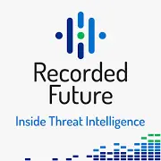
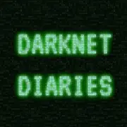

# Podcasts For the Budding Cyber Security Enthusiast

[//]: # (Opening about my love of podcasts)
---

### Daily Security news briefings

<u>SANS ISC Stormcast</u>: Despite the logo looking like it was made by a 12 year old in MS Paint, the SANS ISC Stormcast is a great little 5-10 minute news briefing every morning by the SANS institute’s research director Dr. Johannes Ullrich. He really knows how to give the important technical details and none of the filler.

<u>The Cyber Wire</u>: The Cyber Wire is a more in depth briefing on the day’s happenings. There's also a technical segment with an expert at the end. Lately Juniper Networks has sponsored them to do "Resaerch Saturdays" which is a deep dive conversation with researchers and analysts on what vulnerabilities are plaguing the cyberspace.

### Long Form Security Podcasts

<u>Beers With Talos</u>: Five Talos security researchers and managers host this podcast which discusses the fortnight’s happenings. They also occasionally have different guests from cyber security to talk about their research or events coming up. This is a pretty jokey podcast and you get to know the personalities of Talos.

<u>Paul’s Security Weekly</u>: Paul's Security Weekly is the functional dysfunctional family of security podcasts. It has several international hosts from pentesting, government, corporate and small business security all drinking and making sly jabs at each other while making the best three hour security podcast there is. They usually have multiple guests do deep dives on security topics. It’s good if you want to get an idea of how multiple different departments approach security.

<u>Down The Security Rabbithole</u>: Down The Security Rabbithole gives the oh so important perspective of security from the business. They bring guests on to talk about how different vulnerabilities affect business and how to bridge the gap between the technical security side and the corporate suits.

<u>Tech Snap</u>: More Sys/Network Admin centric podcast, but they also do technical deep dives into security news.

<u>Recorded Future</u>:

### Security History

<u>Malicious Life</u>: Another great storytelling podcast with high production value like Darknet Diaries. However, Malicious Life is done by an Israeli, so you get more of an international perspective which is always nice to have.

<u>Darknet Diaries</u>:

### Linux Centric

<u>Bad Voltage</u>:

<u>Choose Linux</u>:

<u>Linux Unplugged</u>:

<u>User Error</u>:

### Software Development

<u>Coder Radio</u>: