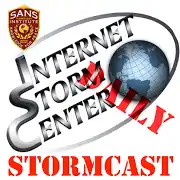
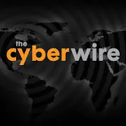
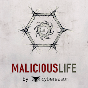

# Podcasts For the Budding Cyber Security Enthusiast

[//]: # (Opening about my love of podcasts)

### Daily news briefings

<u>SANS ISC Stormcast</u>: Short Little 5-10 minute news briefing every morning by the SANS institute’s research director

<u>The Cyber Wire</u>: More in depth briefings on the day’s happenings. Also, a technical segment with an expert at the end.

### Long Form Podcasts

<u>Beers With Talos</u>: 4/5 hosts who are managers in Cisco’s Talos division. They talk about the fortnight’s happenings. They also get into more Cisco specific news. This is a pretty jokey podcast and you get to know the personalities of Talos.

<u>Paul’s Security Weekly</u>: Several international hosts from pentesting, government, corporate and small business security. They usually have multiple guests do deep dives on security topics. It’s good if you want to get an idea of how multiple different departments approach security.

<u>Down The Security Rabbithole</u>: Security for the business minded person. They bring guests on to talk about how different vulnerabilities affect business and how to bridge the gap between the technical security side and the corporate suits.

<u>Tech Snap</u>: More Sys/Network Admin centric podcast, but they also do technical deep dives into security news.

### Security History

<u>Malicious Life</u>: Another great storytelling podcast with high production value like Darknet Diaries. However, Malicious Life is done by an Israeli, so you get more of an international perspective which is always nice to have.